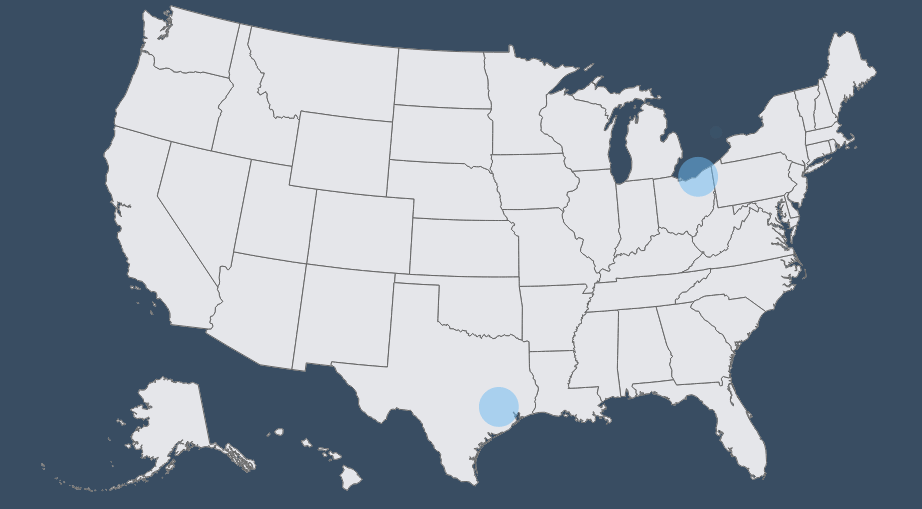

[ ](https://codeship.com/projects/177555)

# realTimeUSA


An example implementation of real time data views on a US map built on top of socket IO

US based tweets from the twitter streaming API are shown on a map drawn with D3 using topoJSON. Howler is used for manipulating sounds.

## Get this rig up and running!
### Install dependencies
`npm install`

### Set up your environment variables
This project uses environment variables to connect to Twitter's streaming API. Go ahead and get yourself some [developer tokens](https://apps.twitter.com/) to use and put them in a `.env` file in the root directory
```
TWITTER_CONSUMER_KEY=####
TWITTER_CONSUMER_SECRET=####
TWITTER_ACCESS_TOKEN_KEY=####
TWITTER_ACCESS_TOKEN_SECRET=####
```

## Run the app
`node app.js`

once you've got the server up and running, check out [http://localhost:3000](http://localhost:3000)

